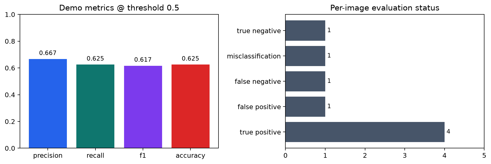

# Defect-Inspection-Evaluation-Dashboard


Evaluation dashboard for visual-inspection model results. It compares ground truth and predictions, separates false positives, false negatives, and class mistakes, then exports reviewable reports.



## What It Does

- Loads annotation and prediction JSON files.
- Keeps the highest-confidence prediction per image after threshold filtering.
- Computes precision, recall, F1, accuracy, and per-image status.
- Displays a confusion matrix, status counts, and FP/FN/misclassification galleries.
- Sweeps confidence thresholds for model review.
- Exports JSON, HTML, and CSV reports.

## Demo Experiment

The included demo uses three small CC0 metal-surface images and hand-written labels/predictions:

```powershell
python scripts/run_evaluation.py --threshold 0.5 --output-dir experiments/demo_experiment
```

Current result at threshold `0.5`:

| Metric | Value |
| --- | ---: |
| Precision | 0.667 |
| Recall | 0.625 |
| F1 | 0.617 |
| Accuracy | 0.625 |
| True positives | 4 |
| False positives | 1 |
| False negatives | 1 |
| Misclassifications | 1 |
| True negatives | 1 |

Experiment artifacts live under `experiments/demo_experiment/`.

## Pipeline

```text
Ground truth JSON + prediction JSON
  -> Parser validation
  -> Threshold filtering
  -> Best prediction per image
  -> Metrics + confusion matrix
  -> FP / FN / misclassification review
  -> JSON / CSV / HTML reports
```

## Quick Start

```powershell
python -m venv .venv
.\.venv\Scripts\activate
pip install -r requirements.txt
streamlit run dashboard/app.py
```

Open:

```text
http://localhost:8501
```

## Input Format

Annotation record:

```json
{"image_id": "part_001", "label": "scratch", "image_path": "sample_data/demo_images/scratched_metal_cc0.jpg"}
```

Prediction record:

```json
{"image_id": "part_001", "label": "scratch", "score": 0.91}
```

Prediction records can omit `image_path` when the annotation file already has it.

## Dataset Notes

Download MVTec AD, VisA, DeepPCB, or other public datasets from official sources. This repository does not redistribute third-party datasets.

Bundled demo images are CC0 and documented in `sample_data/ASSET_SOURCES.md`.

## Repository Layout

```text
dashboard/    Streamlit pages and UI components
core/         parsers, evaluator, error analysis, threshold tuning
sample_data/  demo JSON, CC0 demo images, and asset source records
experiments/  reproducible demo experiment outputs
scripts/      conversion, evaluation, sample generation, report export
docs/         formats, metrics, FP/FN analysis, S3 notes
infra/        AWS deployment notes
tests/        focused checks for evaluator and parsers
```

## Docker

```powershell
docker compose up --build
```
